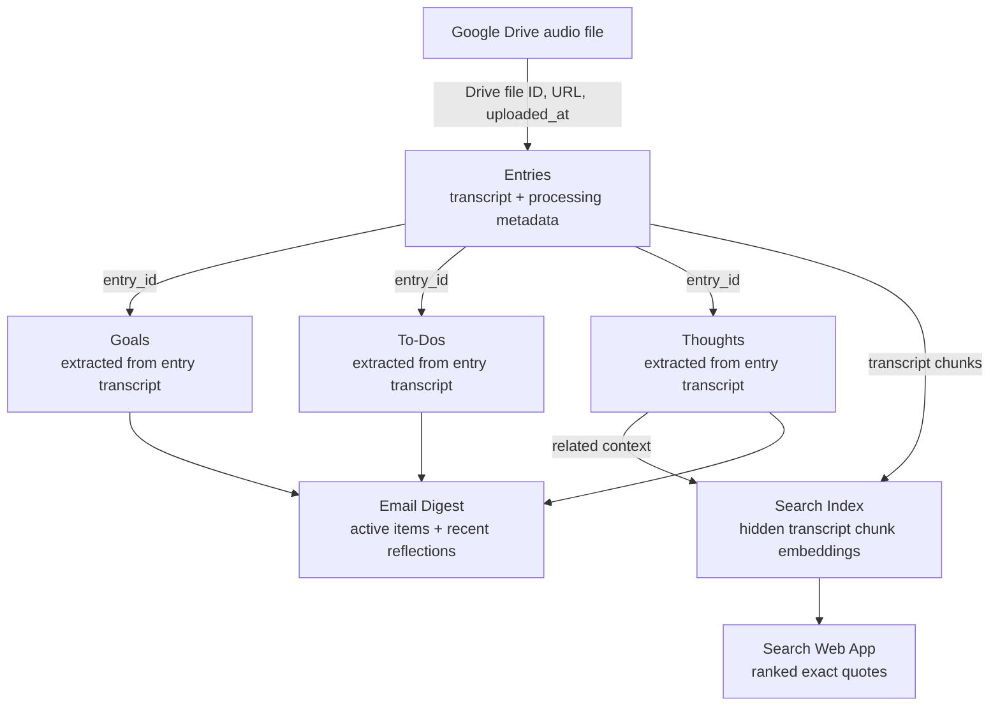

# Voice Memo Journal System

Voice Memo Journal is a lightweight Google Sheets and Google Apps Script project for turning spoken voice memos into a searchable personal journal. It uses a Google Drive inbox folder, OpenAI transcription and extraction, and a Google Sheet as the review surface for entries, goals, to-dos, thoughts, and digest configuration.

For installation instructions, see [SETUP.md](SETUP.md).

## Purpose

The project is designed for fast voice capture. Instead of manually rewriting notes, tasks, and reflections after recording a memo, you upload audio files to a Drive folder and let the Apps Script pipeline process them into structured rows.

The system is meant to help with:

- Capturing journal entries from voice memos.
- Extracting goals and to-dos from natural speech.
- Saving larger reflections as tagged thoughts.
- Tracking digest reminder state directly on active goals and open tasks.
- Reviewing active goals, active to-dos, and recent mood trends in a Sheets-native dashboard.
- Searching prior journal entries from a separate Apps Script web app that returns exact transcript quotes.
- Sending an email digest of active goals, relevant to-dos, and recent reflections.

## Pipeline

The pipeline starts with an audio file in Google Drive and builds structured journal tables from that source file.

1. A voice memo is recorded on a phone.
2. The audio file is uploaded into the configured Google Drive inbox folder.
3. A Google Apps Script poller checks the folder every 15 minutes.
4. Each new Drive file is treated as the source record for one journal entry.
5. The file is transcribed with the OpenAI transcription API.
6. The transcript is sent to an OpenAI text model for structured extraction.
7. The script writes one row to `Entries` for the processed Drive file.
8. The script writes downstream rows to `Goals`, `To-Dos`, and `Thoughts` based on the extracted transcript content.
9. Transcript chunks are embedded into the hidden `Search Index` tab for quote search.
10. The web app searches the index and returns exact transcript quotes with source metadata.
11. A scheduled digest email summarizes active goals, relevant to-dos, due reminders, and recent reflections.

In short:



## Data Model

The Google Drive audio file is the root object in the data model. The script uses the Drive file ID to deduplicate processing, so one unique Drive file should produce one `Entries` row.

`Entries` is the primary journal table. It is derivative of the Drive file and stores the file link, Drive file ID, upload time, transcript, processing status, retry count, and extraction flags. It is the parent record for all extracted journal content.

`Goals`, `To-Dos`, and `Thoughts` are downstream tables. They are not independent source records; they are derived from the transcript stored in `Entries`. Each row links back to its source entry with `entry_id`.

Goals and to-dos carry their own digest reminder state, including when the next reminder is due, when it was last included as due, and how many reminder nudges have been sent. Thoughts remain stateless and are included by recency.

`Search Index` stores transcript chunks, embeddings, and search metadata. It is hidden during setup and is treated as derived data; it can be refreshed or rebuilt from the processed `Entries` and `Thoughts` tables.

`Config` is separate from the journal lineage. It stores user-controlled settings such as the Drive inbox folder, digest recipient, model names, reminder defaults, search settings, and mood tag list.

The core relationships are:

- One Google Drive audio file creates one `Entries` row.
- One `Entries` row can create zero or more `Goals` rows.
- One `Entries` row can create zero or more `To-Dos` rows.
- One `Entries` row can create zero or more `Thoughts` rows.
- `Thoughts` rows do not create reminders by default.

## Project Structure

- `src/Code.js`: Google Apps Script backend implementation.
- `src/Index.html`: Apps Script web app UI for journal quote search.
- `test/voice_journal.test.js`: Local mock tests for pure helper behavior.
- `README.md`: High-level project overview.
- `SETUP.md`: Detailed setup and operating instructions.

## Google Sheet Tabs

Running `setupVoiceJournalSheet()` creates and maintains these tabs:

- `Dashboard`: Leftmost interactive review surface with active goals, active to-dos, and a 7-day moods chart.
- `Entries`: One row per processed voice memo, including transcript, status, retry count, and error details.
- `Goals`: Goal records extracted from transcripts.
- `To-Dos`: Task records extracted from transcripts.
- `Thoughts`: Reflection records with mood tags.
- `Search Index`: Hidden transcript chunk embedding index used by the web app.
- `Config`: User-editable configuration values and quick-action buttons.

## Search Web App

The recommended search interface is the Apps Script web app served by `Index.html`. It provides a browser page with a query box, result filters, index status, refresh/rebuild controls, and ranked quote cards. Results are exact transcript excerpts with nearby context, `entry_id`, upload date, audio link, related thoughts, and moods.

The legacy Sheets menu actions for refreshing and rebuilding the search index remain available, but the sheet is no longer the primary place to send search queries.

## Review Workflow

Every processed memo creates one `Entries` row. Extracted goals, to-dos, and thoughts are linked back to that entry through `entry_id`.

The `status` fields are intentionally simple. Values like `Open`, `Active`, `Done`, `Complete`, and `Archived` control what remains active in reminders and digests. Completed or archived goals and to-dos are ignored by future digest reminder logic.

The `Dashboard` tab rebuilds from the source tables. It shows active to-dos with checkboxes that update the source `To-Dos.status` field, active goals with a `Complete` or `Archive` dropdown that updates `Goals.status`, plus a pie chart of mood tags from the last 7 days of `Thoughts`. Goal status edits do not automatically reload the dashboard, so the sheet does not jump while you are reviewing it.

The `uploaded_at` value comes from the Google Drive file's last-updated time. Extracted goals, to-dos, and thoughts use that same Drive timestamp for `created_at`, while `processed_at` records when the journal processed the file.

## Configuration

The most important `Config` values are:

- `DRIVE_INBOX_FOLDER_ID`: Google Drive folder where phone voice memos are uploaded.
- `DIGEST_RECIPIENT_EMAIL`: Email address that receives journal digests.
- `TRANSCRIPTION_MODEL`: OpenAI audio transcription model.
- `EXTRACTION_MODEL`: OpenAI text model for structured extraction.
- `DIGEST_FREQUENCY_PER_WEEK`: Number of digest days per week.
- `DIGEST_SEND_HOUR`: Hour of day for scheduled digest delivery; default `18` sends at 6 PM.
- `DIGEST_LOOKBACK_DAYS`: Number of days included in recent thought and to-do review.
- `EMBEDDING_MODEL`: OpenAI embedding model used by journal search.
- `SEARCH_MAX_RESULTS`: Default number of web app search results.
- `SEARCH_MIN_SCORE`: Minimum cosine similarity score shown in search results.
- `MOOD_TAGS`: Allowed mood tags for extracted thoughts.

See [SETUP.md](SETUP.md) for the full setup flow.

## Local Tests

Run the local mock tests with:

```bash
node test/voice_journal.test.js
```

These tests do not call Google or OpenAI services. They are intended to validate pure logic such as normalization, retry behavior, and digest scheduling rules.

## Current Limitations

- The Apps Script source is currently deployed by copying `src/Code.js` and `src/Index.html` into a bound Apps Script project.
- The pipeline does not archive processed audio files by default.
- Date inference depends on transcript context and may be imperfect for phrases like "tomorrow" or "next week."
- The search web app returns quote retrieval results, not generated answers or chat-style synthesis.

## Credits

- Project concept and repository: Marko Suchy.
- Implementation assistance: OpenAI ChatGPT/Codex.
- Platform services: Google Sheets, Google Drive, Google Apps Script, and OpenAI APIs.
