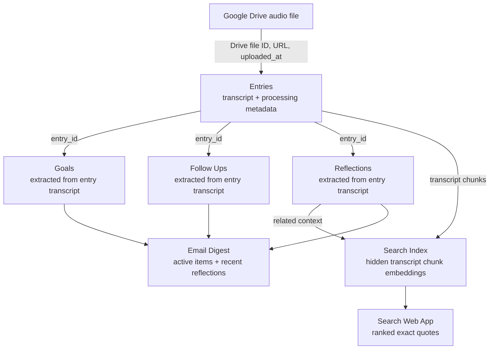

# Voice Memo Journal System

Voice Memo Journal is a lightweight Google Sheets and Google Apps Script project for turning spoken voice memos into a searchable personal journal. It uses a Google Drive inbox folder, OpenAI transcription and extraction, and a Google Sheet as the review surface for entries, goals, follow ups, reflections, and digest configuration.

For installation instructions, see [SETUP.md](SETUP.md).

## Purpose

The project is designed for fast voice capture. Instead of manually rewriting notes, tasks, and reflections after recording a memo, you upload audio files to a Drive folder and let the Apps Script pipeline process them into structured rows.

The system is meant to help with:

- Capturing journal entries from voice memos.
- Extracting goals and follow ups from natural speech.
- Saving larger reflections with mood tags.
- Tracking digest reminder state directly on active goals and open follow ups.
- Reviewing active goals, active follow ups, and recent mood trends in a Sheets-native dashboard.
- Searching prior journal entries from a separate Apps Script web app that returns exact transcript quotes.
- Sending an email digest of active goals, relevant follow ups, and recent reflections.

## Pipeline

The pipeline starts with an audio file in Google Drive and builds structured journal tables from that source file.

1. A voice memo is recorded on a phone.
2. The audio file is uploaded into the configured Google Drive inbox folder.
3. A Google Apps Script poller checks the folder every 15 minutes.
4. Each new Drive file is treated as the source record for one journal entry.
5. The file is transcribed with the OpenAI transcription API.
6. The transcript is sent to an OpenAI text model for structured extraction.
7. The script writes one row to `Entries` for the processed Drive file.
8. The script writes downstream rows to `Goals`, `Follow Ups`, and `Reflections` based on the extracted transcript content.
9. Transcript chunks are embedded into the hidden `Search Index` tab for quote search.
10. The web app searches the index and returns exact transcript quotes with source metadata.
11. A scheduled digest email summarizes active goals, relevant follow ups, due reminders, and recent reflections.

In short:



## Data Model

The Google Drive audio file is the root object in the data model. The script uses the Drive file ID to deduplicate processing, so one unique Drive file should produce one `Entries` row.

`Entries` is the primary journal table. It is derivative of the Drive file and stores the file link, Drive file ID, upload time, transcript, processing status, retry count, and extraction flags. It is the parent record for all extracted journal content.

`Goals`, `Follow Ups`, and `Reflections` are downstream tables. They are not independent source records; they are derived from the transcript stored in `Entries`. Each row links back to its source entry with `entry_id`.

Goals and follow ups carry their own digest reminder state, including when the next reminder is due, when it was last included as due, and how many reminder nudges have been sent. Reflections remain stateless and are included by recency.

`Search Index` stores transcript chunks, embeddings, and search metadata. It is hidden during setup and is treated as derived data; it can be refreshed or rebuilt from the processed `Entries` and `Reflections` tables.

`Design` defines extraction types. It is seeded with Follow Ups, Goals, and Reflections, and custom rows can create their own destination sheets. Keywords gate custom AI extraction unless a row explicitly allows AI to decide without a keyword hit.

`Config` is separate from the journal lineage. It stores user-controlled settings such as the Drive inbox folder, digest recipient, model names, reminder defaults, search settings, and mood tag list.

The core relationships are:

- One Google Drive audio file creates one `Entries` row.
- One `Entries` row can create zero or more `Goals` rows.
- One `Entries` row can create zero or more `Follow Ups` rows.
- One `Entries` row can create zero or more `Reflections` rows.
- `Reflections` rows do not create reminders by default.

## Project Structure

- `src/*.js`: Google Apps Script backend files, split by domain and copied into the bound Apps Script project.
- `src/Index.html`: Apps Script web app UI for journal quote search.
- `test/load_app_script.js`: Local test loader for the split Apps Script files.
- `test/voice_journal.test.js`: Local mock tests for pure helper behavior.
- `README.md`: High-level project overview.
- `SETUP.md`: Detailed setup and operating instructions.

## Google Sheet Tabs

Running `setupVoiceJournalSheet()` creates and maintains these tabs:

- `Dashboard`: Leftmost interactive review surface with active goals, active follow ups, and a 7-day moods chart.
- `Entries`: One row per processed voice memo, including transcript, status, retry count, and error details.
- `Goals`: Goal records extracted from transcripts.
- `Follow Ups`: Follow up records extracted from transcripts.
- `Reflections`: Reflection records with mood tags.
- `Design`: User-editable extraction definitions, seeded with the three built-in extraction types.
- `Search Index`: Hidden transcript chunk embedding index used by the web app.
- `Config`: User-editable configuration values and quick-action buttons.

## Design Tab

The `Design` tab lets you add extraction types without editing code. Each row has an extraction key, display name, destination sheet, description, optional `fact_table_dictionary` JSON, keywords, an AI-without-keyword toggle, status, action, backfill cursor, and error fields.

Custom rows can define custom fact columns with `fact_table_dictionary`. Field keys must be `snake_case`; supported types are `string`, `number`, `boolean`, `date`, and `enum`. Reserved metadata columns cannot be overridden: the custom id column, `entry_id`, `matched_keywords`, `created_at`, and `extracted_at`. If the dictionary is blank, custom rows use `summary`, `evidence`, and `status`.

Example:

```json
{
  "fields": [
    { "key": "summary", "type": "string", "description": "Book title or recommendation summary." },
    { "key": "author", "type": "string", "description": "Author name, blank if unknown." },
    { "key": "priority", "type": "enum", "description": "Reading priority.", "values": ["low", "medium", "high"] }
  ]
}
```

For custom rows, choose `Create Sheet` or `Run Backfill` in the action cell, or select the row and run `Voice Journal > Run Selected Design Action`. Adding fields adds columns. Removing fields from JSON does not delete old columns, and renaming a field is treated as adding a new column.

## Search Web App

The recommended search interface is the Apps Script web app served by `Index.html`. It provides a browser page with a query box, result filters, index status, refresh/rebuild controls, and ranked quote cards. Results are exact transcript excerpts with nearby context, `entry_id`, upload date, audio link, related reflections, and moods.

The legacy Sheets menu actions for refreshing and rebuilding the search index remain available, but the sheet is no longer the primary place to send search queries.

## Review Workflow

Every processed memo creates one `Entries` row. Extracted goals, follow ups, and reflections are linked back to that entry through `entry_id`.

The `status` fields are intentionally simple. Values like `Open`, `Active`, `Done`, `Complete`, and `Archived` control what remains active in reminders and digests. Completed or archived goals and follow ups are ignored by future digest reminder logic.

The `Dashboard` tab rebuilds from the source tables. It shows active follow ups with checkboxes that update the source `Follow Ups.status` field, active goals with a `Complete` or `Archive` dropdown that updates `Goals.status`, plus a pie chart of mood tags from the last 7 days of `Reflections`. Goal status edits do not automatically reload the dashboard, so the sheet does not jump while you are reviewing it.

The `uploaded_at` value comes from the Google Drive file's last-updated time. Extracted goals, follow ups, and reflections use that same Drive timestamp for `created_at`, while `processed_at` records when the journal processed the file.

## Configuration

The most important `Config` values are:

- `DRIVE_INBOX_FOLDER_ID`: Google Drive folder where phone voice memos are uploaded.
- `OPENAI_API_KEY_SETUP`: Temporary setup field for the OpenAI API key; `installVoiceJournal()` stores it in Script Properties and clears the cell.
- `DIGEST_RECIPIENT_EMAIL`: Email address that receives journal digests.
- `TRANSCRIPTION_MODEL`: OpenAI audio transcription model.
- `EXTRACTION_MODEL`: OpenAI text model for structured extraction.
- `DIGEST_FREQUENCY_PER_WEEK`: Number of digest days per week.
- `DIGEST_SEND_HOUR`: Hour of day for scheduled digest delivery; default `18` sends at 6 PM.
- `DIGEST_LOOKBACK_DAYS`: Number of days included in recent reflection and follow up review.
- `EMBEDDING_MODEL`: OpenAI embedding model used by journal search.
- `SEARCH_MAX_RESULTS`: Default number of web app search results.
- `SEARCH_MIN_SCORE`: Minimum cosine similarity score shown in search results.
- `MOOD_TAGS`: Allowed mood tags for extracted reflections.

See [SETUP.md](SETUP.md) for the full setup flow.

## Installation

The intended setup flow is to copy the workbook/template, fill the required `Config` values, then run `installVoiceJournal()` once from Apps Script. The installer repairs the workbook structure, stores the OpenAI key securely, installs the inbox poller, installs the digest trigger when a digest recipient is configured, and refreshes the dashboard.

Manual repair functions such as `setupVoiceJournalSheet()`, `installVoiceMemoPoller()`, and `installDailyDigestTrigger()` remain available from the Apps Script editor or the `Voice Journal` menu.

## Local Tests

Run the local mock tests with:

```bash
node test/voice_journal.test.js
```

These tests do not call Google or OpenAI services. They are intended to validate pure logic such as normalization, retry behavior, and digest scheduling rules.

## Current Limitations

- Apps Script deployment is still copy-based, but the backend is now split across multiple `src/*.js` files.
- The pipeline does not archive processed audio files by default.
- Date inference depends on transcript context and may be imperfect for phrases like "tomorrow" or "next week."
- The search web app returns quote retrieval results, not generated answers or chat-style synthesis.

## Credits

- Project concept and repository: Marko Suchy.
- Implementation assistance: OpenAI ChatGPT/Codex.
- Platform services: Google Sheets, Google Drive, Google Apps Script, and OpenAI APIs.
